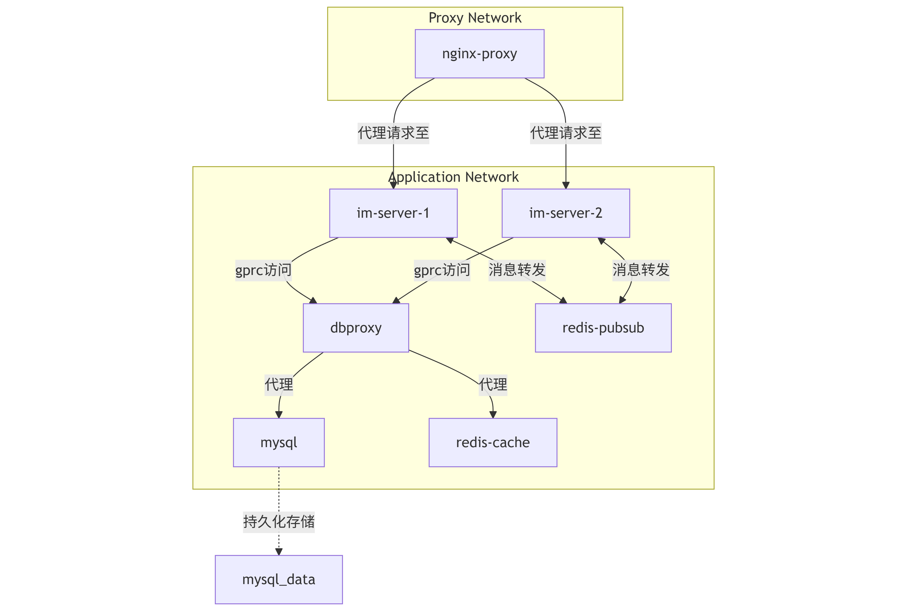

# IMServer - 即时通讯服务器

<div align="center">


一个基于 Go 语言开发的高性能即时通讯服务器，支持 WebSocket 通信、消息推送、用户管理等功能。

</div>

## 📋 目录

- [功能特性](#功能特性)
- [系统架构](#系统架构)
- [技术栈](#技术栈)
- [快速开始](#快速开始)
- [部署说明](#部署说明)
- [开发指南](#开发指南)

## ✨ 功能特性

- 💬 实时消息通信
- 👥 用户管理
- 🔐 身份认证
- 📱 WebSocket 支持
- 🔄 消息持久化
- 🚀 高并发支持
- 🔍 消息历史记录
- 👥 好友管理

## 🏗 系统架构



系统采用微服务架构，主要包含以下组件：

- **IM 服务器**：处理 WebSocket 连接和消息转发
- **DBProxy**：数据访问层，处理数据库操作
- **Redis**：消息队列和缓存
- **MySQL**：数据持久化存储
- **Nginx**：负载均衡和反向代理

## 🛠 技术栈

- **后端**：Go
- **数据库**：MySQL
- **缓存**：Redis
- **通信**：WebSocket、gRPC
- **容器化**：Docker
- **代理**：Nginx

## 🚀 快速开始

### 环境要求

- Go 1.24.2 或更高版本
- Docker 和 Docker Compose
- MySQL 8.0
- Redis 5.0

### 编译

```bash
# 编译可执行文件
./build.sh
```

### Docker 镜像构建

```bash
# 构建 DBProxy 镜像
docker build -f Dockerfile.dbproxy -t dbproxy.v1.0 .

# 构建 IM 服务器镜像
docker build -f Dockerfile.im -t imserver.v1.0 .
```

## 📦 部署说明

### 使用 Docker Compose 部署

```bash
# 启动所有服务（前台运行）
docker-compose up

# 后台运行
docker-compose up -d

# 查看服务状态
docker-compose ps

# 重新构建指定服务的镜像
docker-compose build --no-cache <service-name>
```

### 服务说明

- **IM 服务器**：提供 WebSocket 服务和消息处理
- **DBProxy**：处理数据库操作和缓存
- **Redis**：提供消息队列和缓存服务
- **MySQL**：数据持久化存储
- **Nginx**：负载均衡和反向代理

## 👨‍💻 开发指南

### 项目结构

```
.
├── src/                # 源代码目录
│   ├── dbproxy/       # 数据库代理服务
│   ├── models/        # 数据模型
│   ├── proto/         # Protocol Buffers 定义
│   ├── router/        # 路由配置
│   ├── service/       # 业务逻辑
│   └── utils/         # 工具函数
├── docker/            # Docker 相关配置
├── nginx/             # Nginx 配置
└── mysql/             # MySQL 初始化脚本
```

### 开发环境设置

1. 克隆仓库
```bash
git clone https://github.com/marcohoyang/IMServer.git
cd IMServer
```

2. 安装依赖
```bash
go mod download
```

3. 配置环境变量
```bash
cp .env.example .env
# 编辑 .env 文件配置必要的环境变量
```

## 📝 许可证

本项目采用 MIT 许可证 - 详见 [LICENSE](LICENSE) 文件

## 👥 贡献指南

欢迎提交 Issue 和 Pull Request！

1. Fork 本仓库
2. 创建您的特性分支 (`git checkout -b feature/AmazingFeature`)
3. 提交您的更改 (`git commit -m 'Add some AmazingFeature'`)
4. 推送到分支 (`git push origin feature/AmazingFeature`)
5. 开启一个 Pull Request

## 📞 联系方式

- 作者：marcohoyang
- 邮箱：yanghongxin1997@foxmail.com
